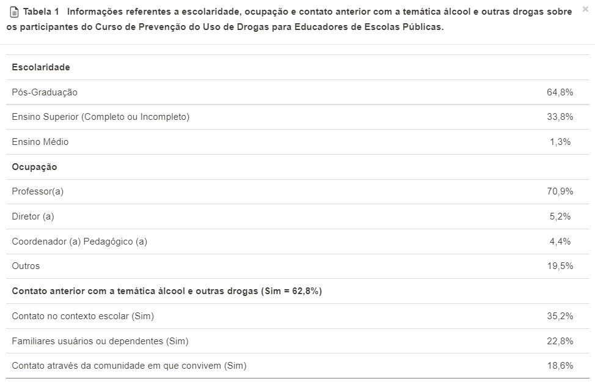
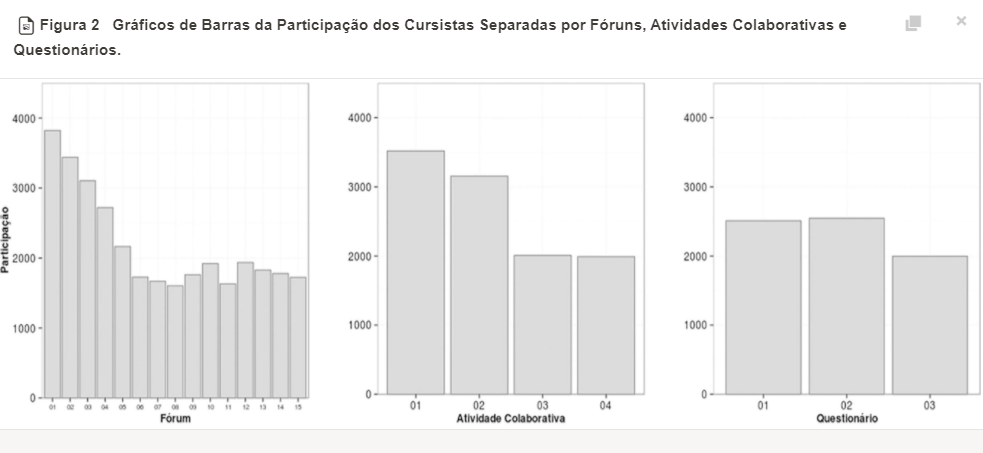

### Curso

#### Introdução

- Curso de sensibilização para a construção de práticas preventivas em contextos escolares na área de álcool e outras drogas
- Ações que envolvam estratégias preventivas eficientes, apontando os componentes eficazes, a relação custo-benefício e a probabilidade de adaptação do programa aos contextos em que as ações de prevenção são operacionalizadas

#### Detalhes

- Do estado para educadores de escola pública
- Participaram 4.960 educadores de Minas Gerais, Rio de Janeiro e Paraná
- Online à distância (Moodle)
- Duração de 8 meses
- 5 módulos (4 teóricos e 1 de prática de implementação)
- > Quinze Fóruns Virtuais de Discussão do conteúdo específico de cada unidade. Cada Fórum objetivava criar espaço para discussão de uma questão formulada pelo professor do Módulo, abordando os objetivos da unidade.
- > Atividades Colaborativas realizadas por educadores pertencentes ao mesmo grupo escolar ao final de cada módulo (quatro ao todo). Cada uma das atividades objetivou a construção de uma etapa do projeto de prevenção ao uso de álcool e outras drogas a ser implementado no contexto escolar, objetivo primário do curso.
- > Questionário avaliativo e conteudista ao final de cada Módulo - respondido por todos educadores. Essa atividade foi realizada três vezes, não sendo aplicada durante o módulo 4 em virtude do maior número de Fóruns de Discussão desta etapa. Estes questionários abordavam questões teóricas chave sobre as temáticas apresentadas no material didático, buscando avaliar o entendimento dos cursistas de pontos essenciais sobre o processo de prevenção do uso de álcool e outras drogas, discutidos em cada Módulo.
- > Devido ao fato de o curso ter uma duração considerável, as coletas das informações necessárias aos objetivos almejados no presente artigo foram feitas em momentos distintos.
- > Sendo assim, foram realizadas duas coletas de dados para obter os resultados pretendidos. Inicialmente foram coletadas informações sociodemográficas tais como sexo, idade, escolaridade, ocupação e contato prévio com a temática álcool e outras drogas **(obtidas ao final do Módulo 1 do curso) (n = 3.247)** e, posteriormente, as informações de avaliação de aspectos do curso e sobre o acesso às ferramentas virtuais de aprendizagem **(coletadas ao final do Módulo 4) (n = 1.950)**.
- > Coleta de Dados. A coleta de dados foi realizada de maneira virtual, através de questionários com questões fechadas para as variáveis sociodemográficas e avaliativas do curso. Os registros de acesso à plataforma foram utilizados para coletar as variáveis de realização das atividades pedagógicas. Os dados foram extraídos utilizando os módulos de questionário oferecidos pela plataforma Moodle.
- > No presente estudo, foram investigadas as variáveis abaixo listadas através de questionários de caracterização dos participantes do curso e dos aspectos organizacionais desse, disponibilizados virtualmente.

### Questionário

- Questionário sócio-demográfico - aplicado ao final do módulo 1 com o objetivo de caracterizar a amostra a partir das seguintes variáveis: sexo, idade, nível de formação, ocupação, contato prévio com a temática álcool e outras drogas, motivos para participação do curso.

- Questionário de avaliação dos processos pedagógicos - aplicado ao final do módulo 4 com o objetivo de avaliar o curso a partir das seguintes questões: adequação do material didático, flexibilidade do prazo de entrega das atividades, avaliação da importância das atividades nos fóruns - interação com outros cursistas, organização do curso, importância do auxílio do tutor. Este questionário foi usado para fins de pesquisa, não sendo, portanto, atribuído a ele notas. As informações nele contidas foram desenvolvidas e analisadas pela equipe de pesquisa do Curso de Prevenção do Uso de Drogas para Educadores de Escolas Públicas.

- Registros de atividades - participação dos alunos extraída ao final do curso usando os registros de acessos da plataforma virtual.

### Resultados

- Muito mais mulheres do que homens (85.8%). Maioria com mais de 32 anos (Média = 40.7).
  - Seria isso causado pela população de professores nos Estados?
- > O questionário com questões relacionadas à motivação e satisfação de participação no curso foi respondido virtualmente por 1950 educadores-cursistas (41,56% dos alunos ativos durante o período de coleta de dados) durante o período de finalização das atividades do Módulo 4, período este em que 2.429 alunos se encontravam ativos no curso.
  - Quantos profissionais deixaram de fazer o curso na metade?
  - Qual o perfil desses profissionais?
- > Com relação às razões para participação no curso, 29,1% responderam "por ser uma oportunidade de formação continuada", 17,2% "por identificação profissional com o tema", 3,1% "por identificação pessoal com o tema", 0,7% "pelo fato de o curso estar vinculado à Universidade", 0,4% "Por ser um curso à distância" e 0,2% "pelo fato de o curso ser gratuito".
  - Como a motivação de cada um impacta o desempenho?
- > Em relação ao material didático, 99,3% dos participantes consideraram-no muito adequado ou adequado e 0,7% como pouco adequado ou nada adequado. Sobre a flexibilidade dos prazos para realização das atividades, 65,3% avaliaram este como "flexível", 17,4% como "muito flexível", 17,3% como "pouco ou nada flexível".
  - Por que alguns acharam inflexível?
- > Sobre a importância de interação com outros colegas através do ambiente virtual de aprendizagem, 50,3% dos respondentes avaliaram tal interação como "muito importante", 45,1% como "importante" e 4, 7% como "pouco ou nada importante"
  - Por que alguns não acharam importante?
- > Com relação à organização do curso de uma forma geral, 50,6% consideraram o curso "organizado", 47,5%, "muito organizado" e 1,9% "desorganizado ou muito desorganizado".
  - Por que alguns consideram desorganizado?
- > Sobre a mediação e auxílio do tutor à distância, 75,1% consideram tal auxílio como "sempre importante", 22,3% disseram que este suporte é necessário "às vezes" e 2,7% consideraram que tal auxílio "não é necessário".
  - Por que alguns consideram desnecessário?
- A figura 2 mostra que a participação tende a cair com o tempo. Mas qual é a distância de tempo exata entre os eventos? Quando eles ocorrem (ex: perto de feriados?)

### Notas

- Existe um viés de sobrevivente nas respostas. Ao final, só temos respostas daqueles que chegaram ao final do curso.

### Outras perguntas

- Os módulos do curso são cumulativos? O que acontece se alguém se perder?
- Como as expectativas dos alunos foram atendidas, especialmente os que saíram? (O curso era realmente importante para os que saíram? Um método de diminuir a evasão em si é simplesmente evitar incluir pessoas que saem, embora isso possa não ter o impacto final desejado nos jovens)
- E os profissionais, passaram a atuar de fato em suas vidas profissionais? Por quanto tempo?

### Extra

#### Artigo: Evasão em curso via internet: explorando variáveis explicativas

- Falta de comprometimento do aluno pode faciliar a evasão (exemplos de comprometimento: pagar pelo curso, investir tempo em fazer atividades, interagir com outras pessoas).
- Como, inclusive, levantado acima, fatores motivacionais (qual o valor do curso para o aluno?) e ambientais (pressupondo-se motivação, o quão é fácil para um aluno se dedicar aos estudos?).
- > Além disso, observam-se avaliações de aprendizagem imprecisas e inválidas; ausência de avaliação nos níveis de transferência ou impacto no desempenho, resultados e valor final
- > Neste estudo, as variáveis relativas à interação do participante com os recursos eletrônicos do curso mostraram-se importantes variáveis explicativas do perfil que diferencia concluintes de não concluintes de um curso mediado pela Internet.
  - > Shin e Kim (1999), testando uma análise de regressão logística para investigar os fatores associados à evasão em cursos, descobriram que o uso de atividades face a face associava-se à retenção de alunos, sugerindo que atividades presenciais de interação entre os participantes e os tutores são fatores que diminuem a evasão. Mais estudos são necessários para verificar o quanto a formação de comunidades virtuais de aprendizagem substitui as interações face a face (tutor-aluno e aluno-aluno) e contribui na explicação da persistência em cursos a distância mediados pela Web.
